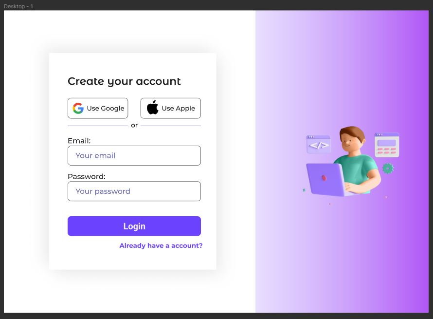
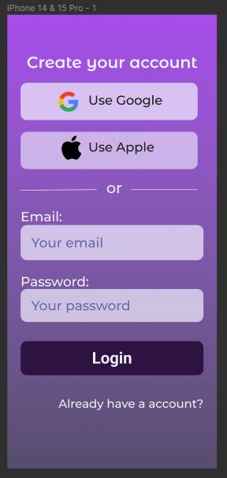
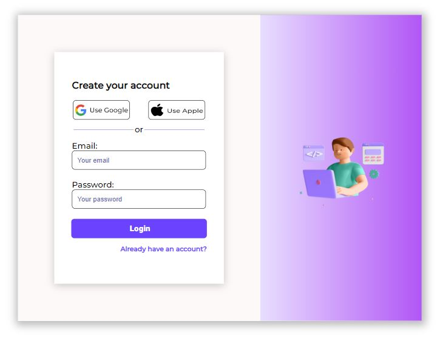
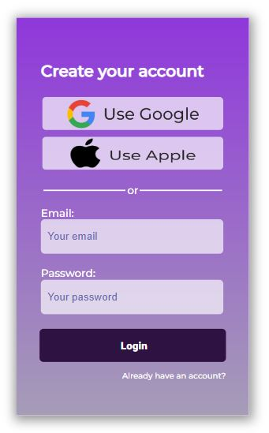

# Proyecto: Codificación - Diseño de Figma

## Índice

1. [Introducción](#introducción)
2. [Objetivos Generales](#objetivos-generales)
3. [Criterios de Aceptación](#criterios-de-aceptación)
4. [Criterios de Evaluación](#criterios-de-evaluación)
5. [Entrega](#entrega)
6. [Imágenes muestra](#imágenes-muestra)

## Introducción

Este proyecto consiste en la implementación en código HTML Y CSS de un diseño proporcionado en Figma. El diseño original fue establecido de tal forma que requería la adaptación y finalización tanto para la visualización en escritorio como en dispositivos móviles.

## Objetivos Generales

El objetivo principal de este proyecto es transformar el diseño de Figma en una interfaz de usuario funcional y atractiva, garantizando la fidelidad al diseño original. Además, se espera que el código resultante cumpla con estándares de limpieza y buenas prácticas de desarrollo.

## Criterios de Aceptación

- Todos los elementos del diseño original en Figma deben estar presentes en la implementación.
- La interfaz debe ser completamente responsive, asegurando una experiencia de usuario óptima tanto en dispositivos de escritorio como móviles.

## Criterios de Evaluación

La evaluación del proyecto se centrará en los siguientes aspectos:

- Precisión en la implementación del diseño en código.
- Manejo de código limpio y organizado.
- Cumplimiento de estándares web y buenas prácticas de desarrollo.

## Entrega

La entrega del proyecto se realizará proporcionando el enlace al repositorio de GitHub, donde se encuentra el código fuente del proyecto. Además, se adjuntará una captura de pantalla del proyecto en funcionamiento tanto en un entorno de escritorio como en un dispositivo móvil.

---

## Imágenes muestra

**Diseños en Figma para PC y Móvil.**

**Codificación para PC y Móvil.**

